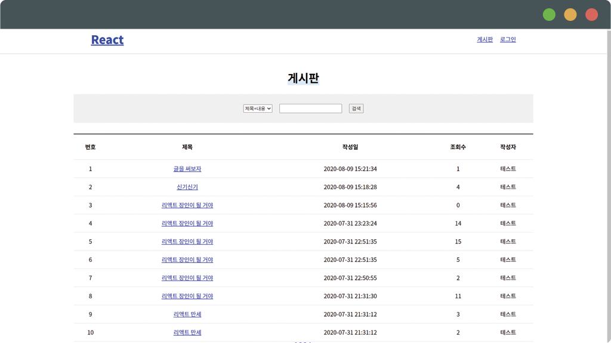

# 리액트 + Restful 스프링 게시판 시행착오 프로젝트

## 진행 현황

### 회원

- [x] 로그인
- [ ] 회원가입

### 게시판

- [x] 목록
- [x] 글 보기
- [x] 글 쓰기
- [ ] 글 수정
- [x] 글 삭제
- [x] 게시글을 쓰기/삭제했을 때 페이지가 줄어든다면 렌더링을 고쳐줘야 한다.
- [x] 게시글을 작성하거나 삭제했을 때 1페이지로 이동하도록 수정

## 제작 의도

- 반복되는 코드를 줄일 수 있지만 줄이지 말고 반복할 것.
  - API 서버에 요청할 때 useReducer를 이용해 지금의 상태정보(loading상태 등)를 바꾸는 것
  - 까먹으면 안 된다. 곱씹으면서 지속적으로 사용되는 패턴을 손가락으로라도 익힐 것

## 진행하면서 부딪힌 점

- 스프링 시큐리티 CSRF 방지 설정 때문에 로그인 연동 시 구현하기 까다롭다😅.
- 스프링 시큐리티가 아니더라도 기존 방식의 로그인은 구현하기 까다롭다😅.
  - 백엔드에서 프런트 단까지 처리해줬을 때는 이미 로그인 상태정보(로그인이 됐는지 / 안 됐는지)를 가지고 있다.
    - 기존 스프링프레임워크에서 뷰엔진을 사용하는 방식
  - 하지만 프런트 단을 별도의 서버로 분리했을 때는 로그인 상태정보가 최신인지 아닌지 모른다.
    - 스프링프레임워크 + React 방식
    - 기존의 방식을 고려한 경우
      - 아무리 상태관리를 잘한다고 한들 새로고침하면 로그인 상태가 풀림
      - LocalStorage에 보관한다고 해도 백엔드에서 만료된 세션이라면 유지해주면 안 된다.
      - 그럼 매번 로그인됐는지 요청해서 여부를 판별하면 안 돼?
        - 프런트 단으로 분리한 거 자체가 백엔드의 부담을 줄이고자 하는 것도 있는데, 로그인을 매번 요청한다면 나눈 의미가 없지 않을까 싶은데...
    - 이래서 JWT 토큰이 등장한 거구나... 그리고 토큰 기반 인증과 서버 기반 인증으로 구별이 된 것도 이 때문이고...

## 앞으로의 계획과 생각

- 이제는 백엔드 서버의 부담을 줄이기 위해서 클라이언트 단에서 처리하는 양이 점점 늘어나겠구나..
  - 클라이언트 단에서는 json정보를 이용해서 이미 가져 온 파일을 기반으로 리액트가 DOM을 조작하듯이...
  - 이전까지는 서버에서 세션 정보를 저장하고 있었다면, 이제는 클라이언트가 토큰을 받아서 가지고 있다거나...
- 리액트 복습
- 로그인/로그아웃의 이슈에 부딪혔지만, 이 이슈는 무시하고 게시판 서비스만 작성
  - ex: 새로고침해서 상태정보가 날아가 로그인이 풀려도 무시하고 진행
- 다음 프로젝트에서는 JWT토큰, redux 상태정보 라이브러리를 이용하여 로그인 서비스 작성
  - 물론 백엔드에서도 JWT토큰 방식의 로그인을 지원해야 함.
- 내가 계획한 대로 설계된 서비스가 없다는 것은 이미 누군가가 시행착오를 겪으며 안 된다는 것을 먼저 알았을 확률이 높다.

## 참고 사이트

- [[JWT/JSON Web Token] 로그인 / 인증에서 Token 사용하기](https://sanghaklee.tistory.com/47)
